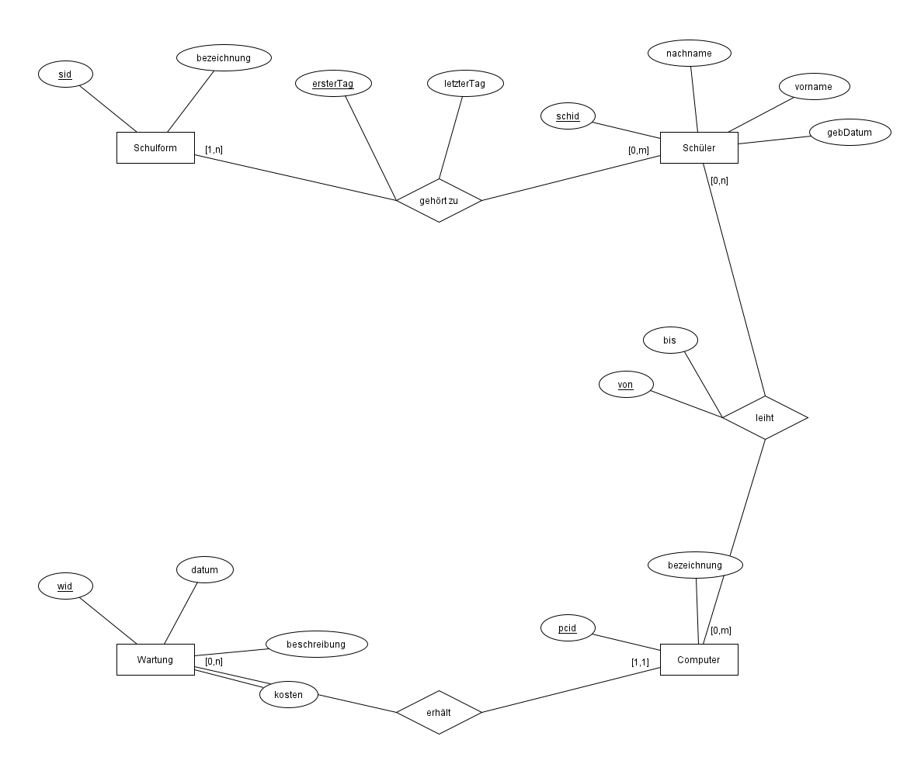
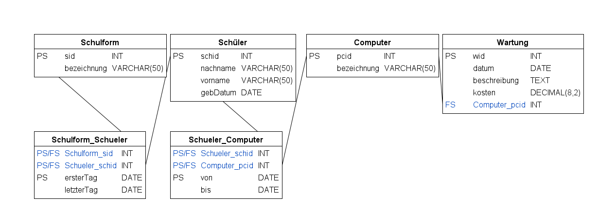

# ARS-ER-Editor

Ein Editor für **Entity-Relationship-Diagramme in Chen-Notation** — und für
das **Relationenmodell**, das daraus entsteht.

Entstanden für die Datenbankreihe im Beruflichen Gymnasium (Praktische
Informatik) an der Adolf-Reichwein-Schule Marburg. Läuft unter Windows, macOS
und Linux; gebraucht wird nur **Java 17 oder neuer**.

## Herunterladen

Das fertige Paket liegt unter **[Releases](../../releases/latest)** —
eine ZIP-Datei, auspacken, starten. Keine Installation, kein Setup.

| | |
|---|---|
| Windows | `ARS-ER-Editor V1.0 starten.bat` doppelklicken |
| macOS | `ARS-ER-Editor V1.0 starten.command` doppelklicken — beim ersten Mal einmalig `chmod +x` nötig, siehe LIESMICH |
| überall | `java -jar ARS-ER-Editor-V1.0.jar` |

## Was es kann

**Volle Chen-Notation.** Entitätstypen als Rechtecke, Beziehungstypen als
Rauten, Attribute als Ellipsen, Schlüssel unterstrichen. Dazu *is-a*,
schwache Entitätstypen, mehrstellige Beziehungen, Attribute an Beziehungen,
Selbstbezug und Parallelbeziehungen.

**Attribute werden eingetippt, nicht gesetzt.** Ein Entitätstyp mit sechs
Attributen wäre sonst sechs Mal Klicken und Ziehen; das Werkzeug ordnet die
Ellipsen selbst um den Kasten an. Verschieben lassen sie sich trotzdem, und
ein verschobener Kasten nimmt sie mit.

**Kardinalitäten in min-max-Notation**, frei beschriftbar und einzeln
verschiebbar.

**Das Relationenmodell ist eine eigene Diagrammart** — Tabellen mit
Schlüsselkennzeichen, Attributname und Datentyp, verbunden durch knickbare
Linien vom Fremdschlüssel zum zugehörigen Primärschlüssel. Strg+F hebt alle
Fremdschlüssel blau hervor.

**Neun Beispiele aus dem Unterricht** liegen bei, vom einfachen Einstieg bis
zu einer Flughafenverwaltung mit sechs Entitätstypen und fünf Beziehungen.

**Eine ausführliche Anleitung steckt im Programm** — Taste F1. Sie erklärt
jedes Werkzeug, die Lesart der Kardinalitäten und das Relationenmodell.

## Für Lehrkräfte

Drei Funktionen sind zunächst **gesperrt**:

- ein ER-Diagramm vollständig ins Relationenmodell **überführen**
- die **textuelle Schreibweise** ausgeben (`Kunde(kid, name)`)
- **CREATE-Befehle** für MariaDB erzeugen

Freigeschaltet werden sie einmalig mit einem Kennwort unter
*Extras → Einstellungen → Lehrerfunktionen*. Danach bleiben sie frei, auch
nach einem Neustart.

**Der Grund:** Das Überführen ist Prüfungsstoff. Wenn das Werkzeug es auf
Knopfdruck erledigt, übt es niemand mehr. *Entitätstabellen erzeugen* — der
halbe Weg, der nur das Abschreiben abnimmt — ist dagegen immer verfügbar;
Fremdschlüssel, Zwischentabellen und Verbindungslinien bleiben Aufgabe.

Lehrkräfte bekommen das Kennwort auf Anfrage. Schreiben Sie mich an und
nennen Sie Ihre Schule.

## Warum der Quelltext nicht hier liegt

Läge er offen, wäre die Sperre in wenigen Minuten entfernt — die Zielgruppe
ist ein Informatik-Leistungskurs. Das ist der einzige Grund. Details stehen
in der [Nutzungserlaubnis](LIZENZ.md).

## Lizenz

Kostenlos nutzbar und weitergebbar für Unterricht, Ausbildung und
Selbststudium; keine kommerzielle Nutzung. Siehe **[LIZENZ.md](LIZENZ.md)**.

Ohne Gewährleistung. Das gilt besonders für die erzeugten CREATE-Befehle:
Sie enthalten auf Wunsch `DROP TABLE IF EXISTS`, und wer ein solches Skript
auf einer Datenbank mit echten Daten ausführt, verliert sie.
